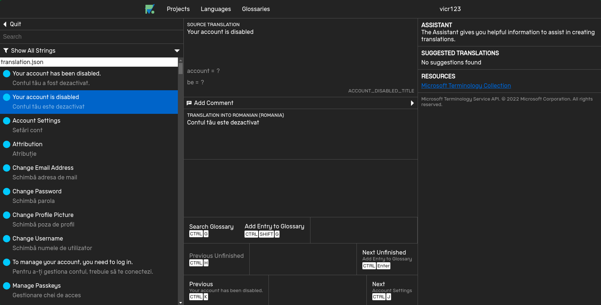
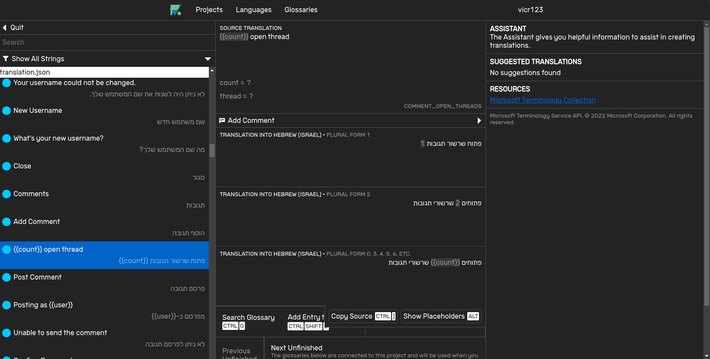

Parlance is a translation management system. It stores translations directly in Git repositories.

Looking to translate Victor Tran software? Visit the [Victor Tran Parlance instance](https://parlance.vicr123.com/).

# Installing Parlance

The easiest way to install Parlance is to use Docker. For an example of an example Docker Compose file that sets up
all necessary services, view [docker-compose.yml](https://github.com/vicr123/DockerFiles/blob/master/standalone/parlance/docker-compose.yml).

# Contributing to Parlance

There are many ways to contribute to Parlance. Your contributions to Parlance are valued.

- If you've found a bug, go ahead and file an [issue](https://github.com/vicr123/Parlance/issues) and we'll get back to you!
- Likewise, feature requests are also welcome in the issues.
- If you speak another language, translations are welcome! Register an account on the [Victor Tran Parlance instance](https://parlance.vicr123.com/) and contact 
  Victor to obtain permissions to write translations.
- Discuss Parlance development in the [Victor Tran Discord Server](https://discord.vicr123.com/).

# Screenshots

# License

Parlance is licensed under the GNU Affero General Public License, version 3 or later.
